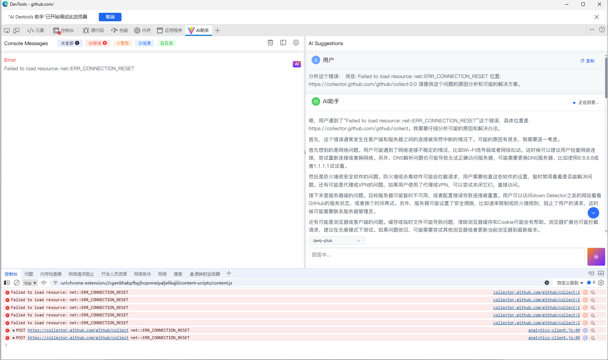

# AI Devtools Assistant

A powerful Chrome DevTools extension for capturing and analyzing browser console messages, providing intelligent problem diagnosis and solutions through AI.

## 📋 Project Overview

AI Devtools Assistant is a Chrome browser extension that captures console errors, warnings, info, and log messages in real-time, and uses AI technology to intelligently analyze these messages, providing developers with problem analysis and solution suggestions.

## ✨ Key Features

### 1. Console Message Capture
- **Real-time Monitoring**: Uses Chrome DevTools Protocol (CDP) to capture console messages in real-time
- **Message Classification**: Automatically categorizes messages into four types: errors, warnings, info, and logs
- **Message Filtering**: Supports filtering messages by type
- **Message Deduplication**: Automatically filters duplicate messages to avoid redundancy
- **Detailed Information**: Displays message URL, line number, column number, function name, and stack trace

### 2. AI-Powered Analysis
- **One-Click Analysis**: Click the "AI" button next to a message to quickly get problem analysis
- **Multi-Model Support**:
  - **AiHubMix Models**: Supports various models like gpt-4o, claude-3-opus, claude-3-sonnet, gemini-pro
  - **Custom Models**: Supports adding your own AI model APIs (such as DeepSeek, Tongyi Qianwen, etc.)
- **Streaming Response**: Real-time streaming display of AI responses for better interaction
- **Markdown Rendering**: Full Markdown format support, including code highlighting, tables, lists, etc.
- **Multi-turn Conversation**: Supports contextual conversations, allowing follow-up questions

### 3. User Interface
- **Split Layout**: Left-right or top-bottom split screen display of console messages and AI suggestions
- **Responsive Design**: Supports horizontal/vertical layout switching
- **Message Statistics**: Real-time display of message counts by type
- **Code Copying**: Supports one-click copying of message content and code blocks



### 4. Model Management
- **Model Configuration**: Supports configuring AiHubMix API keys
- **Custom Models**: Add, edit, and delete custom models
- **Model Selection**: Quickly switch between different AI models
- **Encrypted Configuration**: API keys are stored using Base64 encoding (recommended to upgrade to more secure encryption methods)

## 🚀 Installation & Usage

### Installation Steps

1. **Clone the Repository**
   ```bash
   git clone <repository-url>
   cd AiDevtools
   ```

2. **Install Dependencies**
   ```bash
   pnpm install
   # or
   npm install
   ```

3. **Build the Project**
   ```bash
   pnpm build
   # or
   npm run build
   ```

4. **Load the Extension**
   - Open Chrome browser
   - Navigate to `chrome://extensions/`
   - Enable "Developer mode"
   - Click "Load unpacked"
   - Select the `dist` directory of the project

5. **Use the Extension**
   - Open any webpage
   - Press `F12` to open Developer Tools
   - Find the "AI Devtools Assistant" tab in the DevTools panel
   - Start using!

### Configure AI Models

1. **Configure AiHubMix Models**
   - Click the settings icon (⚙️)
   - Select a model in the "General Settings" tab
   - Enter your AiHubMix API key
   - Save settings

2. **Add Custom Models**
   - Click the settings icon (⚙️)
   - Switch to the "Model Management" tab
   - Click "Add New Model"
   - Fill in model information:
     - Model name (e.g., deepseek-r1)
     - API endpoint (e.g., https://api.example.com/v1/chat/completions)
     - API key (optional)
   - Save the model

## 🛠️ Development Guide

### Project Structure

```
AiDevtools/
├── src/                    # Source code directory
│   ├── components/        # Vue components
│   │   ├── ChatInput.vue  # Chat input component
│   │   └── StreamMd.vue   # Streaming Markdown display component
│   ├── composables/       # Composable functions
│   │   └── useStreamMarkdown.js  # Markdown streaming processing
│   ├── services/          # Service layer
│   │   └── modelApi.js    # Model API service
│   ├── assets/            # Static assets
│   ├── icons/             # Extension icons
│   ├── background.js     # Background script
│   ├── devtools.html      # DevTools page entry
│   ├── devtools.js        # DevTools script
│   └── manifest.json      # Extension manifest file
├── dist/                  # Build output directory
├── panel.html             # Panel HTML entry
├── Panel.vue              # Main panel component
├── vite.config.js         # Vite configuration
└── package.json           # Project configuration
```

### Tech Stack

- **Vue 3**: Uses Composition API to build user interface
- **Vite**: Fast frontend build tool
- **Arco Design Vue**: Enterprise-grade UI component library
- **Chrome Extension API**: Chrome extension development API
- **Chrome DevTools Protocol (CDP)**: Used for capturing console messages
- **Markdown-it**: Markdown parser
- **Highlight.js**: Code highlighting

### Development Commands

```bash
# Development mode (watch for file changes)
pnpm watch

# Build production version
pnpm build

# Build and package extension
pnpm build:extension
```

### Core Functionality Implementation

#### 1. Console Message Capture

Uses Chrome DevTools Protocol's `Console.enable`, `Runtime.enable`, and `Debugger.enable` to capture:
- `Console.messageAdded`: Console messages
- `Runtime.consoleAPICalled`: Console API calls (console.error, console.warn, etc.)
- `Runtime.exceptionThrown`: Runtime exceptions

#### 2. AI Streaming Response

Uses Server-Sent Events (SSE) to implement streaming responses:
- Real-time reception of AI text fragments
- Uses `useStreamMarkdown` composable function to process streaming data
- Supports request abort functionality

#### 3. Unified Model API Management

`modelApi.js` provides a unified model API interface:
- `sendChatToAiHubMix`: Send requests to AiHubMix API
- `sendChatToCustomApi`: Send requests to custom APIs
- `sendChat`: Unified send interface that automatically selects based on model type

## ⚠️ Known Issues & Limitations

### 1. Security Issues
- **API Key Encryption**: Currently uses Base64 encoding to store API keys, which has low security. It's recommended to upgrade to more secure encryption methods (such as using Web Crypto API)
- **Key Management**: API keys are stored locally, which may pose a risk of leakage if the device is accessed by others

### 2. Functional Limitations
- **Message Limit**: Currently saves a maximum of 100 messages, automatically deleting the oldest when exceeded
- **History Messages**: Messages captured before page refresh are lost (not persisted)
- **Multi-tab Support**: Each tab's DevTools panel is independent, cannot view messages across tabs

### 3. Performance Issues
- **Large Message Volume**: When pages generate a large number of console messages, it may affect extension performance
- **Memory Usage**: Long-term use may consume significant memory

### 4. Compatibility Issues
- **Browser Support**: Only supports Chrome/Edge and other Chromium-based browsers
- **CDP Limitations**: Some special pages (such as chrome:// pages) may not be able to use CDP functionality

### 5. User Experience
- **Error Messages**: Some error messages may not be detailed enough
- **Model Configuration**: First-time use requires manual model configuration, lacks guidance flow
- **Internationalization**: Currently only supports Chinese interface

### 6. Code Quality
- **Code Comments**: Some complex logic lacks detailed comments
- **Error Handling**: Some error handling may not be comprehensive enough
- **Type Checking**: Not using TypeScript, lacks type checking

## 🔮 Future Improvements

1. **Security Enhancements**
   - Use Web Crypto API to encrypt API keys
   - Add key import/export functionality
   - Support key expiration reminders

2. **Feature Extensions**
   - Support message persistence
   - Add message search functionality
   - Support message export (JSON/CSV)
   - Add message statistics charts

3. **Performance Optimization**
   - Implement virtual scrolling to support large message volumes
   - Optimize message deduplication algorithm
   - Add message pagination loading

4. **User Experience**
   - Add first-time use guidance
   - Support dark theme
   - Add internationalization support (i18n)
   - Optimize error message information

5. **Code Quality**
   - Migrate to TypeScript
   - Add unit tests
   - Improve code comments
   - Optimize code structure

## 🤖 AI-Assisted Development

This project was completely developed with AI assistance. During the development process, AI helped complete:

- **Project Architecture Design**: Overall project structure and technology selection
- **Core Functionality Implementation**: Console message capture, AI integration, streaming responses, etc.
- **UI Component Development**: Built user interface using Vue 3 and Arco Design
- **Problem Solving**: Debugging and fixing various technical issues
- **Code Optimization**: Performance optimization and code refactoring

This demonstrates the powerful auxiliary capabilities of AI in software development, helping developers quickly build fully functional applications.

## 📝 License

This project is licensed under the MIT License.

## 🙏 Acknowledgments

- [Vue.js](https://vuejs.org/) - Progressive JavaScript Framework
- [Vite](https://vitejs.dev/) - Next Generation Frontend Tooling
- [Arco Design](https://arco.design/) - Enterprise Design Language and Component Library
- [AiHubMix](https://aihubmix.com/) - AI Model Aggregation Platform

---

**Note**: This project is for learning and research purposes only. When using AI model APIs, please comply with the relevant service terms of use and privacy policies.

